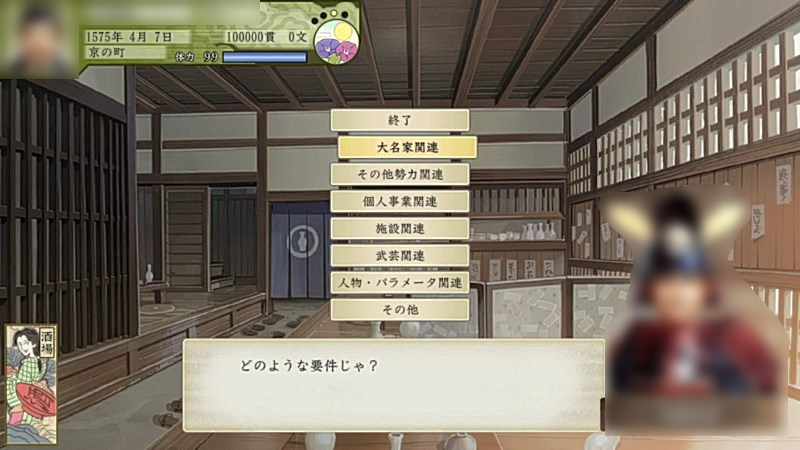

# Taiko5dxMyEvents

## 参考文献

1. [太閤立志伝５ イベコンwiki](https://seesaawiki.jp/taikou5/)
1. [太閤立志伝Ⅴ DXイベントコンバーターのヘルプ](https://www.gamecity.ne.jp/manual/KSjyrFfh/Taiko5DXEV_JP/index.html)
1. [太閤立志伝５イベントスクリプトアップローダー](http://tukasa.sakura.ne.jp/tr5/joyful.cgi)

## ファイル

|  ファイル名  |  属性 |発生契機| 説明 |
| ---- | ---- | ---- | ---- |
|  いきなり暴れ馬.txt  | 一度だけ | 移動画面表示後(無効) | 選択肢で名馬を手に入れることができる。|
|  いきなり野良犬.txt  | 一度だけ | 移動画面表示後(無効) | 選択肢で「忍犬の術」の札を手に入れることができる。|
|  官位の悪夢.txt  | 一度だけ | 室内画面表示後(無効,自宅) | 官位が上がらない悪夢を見る。|
|  色々便利ツール.txt  | 何度でも | 室内画面表示後(京の町,酒場) | 本リポジトリのメインコンテンツ。詳細は後述。|
|  便利ツール案内.txt  | 一度だけ | ゲームスタート時 | 色々便利ツールの案内。|

## 色々便利ツール

### 概要

登場人物の能力、人間関係、拠点の状態などを変更する自作イベント。

### 目次

* [大名家関連](#大名家関連)
  * 所属大名が他大名を吸収
  * 任意の大名家に隣接大名を消滅させる
  * 任意の大名に家督を譲らせる
  * 一揆を制御
  * 他大名の拠点を攻撃
  * 所属大名の拠点を強化
  * 独立ラッシュ
  * 職歴リセット
* [その他勢力関連](#その他勢力関連)
  * 忍者関連
  * 海賊関連
  * 商人関連
* [個人事業関連](#個人事業関連)
  * 茶道関連
  * 鍛冶関連
  * 医療関連
* [施設関連](#施設関連)
  * 座関連
  * 酒場関連
* [武芸関連](#武芸関連)
  * 個人戦戦績
  * 剣を極める
  * 槍を極める
  * 苦無を極める
  * 鎌を極める
  * 鉄砲を極める
  * 弓を極める
* [人物・パラメータ関連](#人物・パラメータ関連)
  * 金と贈り物（価値４）が欲しい
  * 主人公の名声調整
  * 主人公の悪名調整
  * 勲功調整
  * 親密度調整
  * 能力一括調整
  * 技能一括調整
  * 関係者経緯リセット（円満）
* [その他](#その他)
  * 雑談
  * 案内役変更
  * 雑談相手変更

### 詳細

* ### 大名家関連

  * 所属大名が他大名を吸収
    * 主人公が大名家に所属していない場合は無効。
    * 吸収される側の大名家が所属大名の場合(自分で自分を吸収する場合)、大名家が滅亡して拠点は周辺の他大名が取得する模様。
  * 任意の大名家に隣接大名を消滅させる
    * 消滅させる側の大名を選ぶ。
      1. プロパティ「隣接大名家」が「真」になる大名家のコンテナを作る。
      1. コンテナから消滅大名家を取り出し、スクリプトコマンド「勢力滅亡:(滅亡する大名家,そうさせた大名家)」を実行する。
  * 任意の大名に家督を譲らせる
    * 譲られる側の人物は武将のみ。
  * 一揆を制御
  * 他大名の拠点を攻撃
  * 所属大名の拠点を強化
  * 独立ラッシュ
  * 職歴リセット
    * 大名家との関係を元に戻す。
    * 仕官先の武将に恨まれていると再就職できない。その場合は「関係者経緯リセット（円満）」を使って恨みを解消する必要がある。

* ### その他勢力関連

  * 忍者関連
    * 他所の忍の里の食料を燃やす
      * 主人公が忍者衆に所属していない場合は無効。
    * 忍術を極める
      * 忍術技能が4になる。
      * 忍術師事で取得できる札を入手する。
    * 職歴リセット
      * 忍者衆との関係を元に戻す。
      * 頭に恨まれていると再就職できない。その場合は「関係者経緯リセット（円満）」を使って恨みを解消する必要がある。
  * 海賊関連
    * 他所の海賊の砦の食料を燃やす
      * 主人公が海賊衆に所属していない場合は無効。
    * 水軍を極める
      * 水軍技能が4になる。
      * 水軍師事で取得できる札を入手する。
    * 職歴リセット
      * 海賊集との関係を元に戻す。
      * 頭に恨まれていると再就職できない。その場合は「関係者経緯リセット（円満）」を使って恨みを解消する必要がある。
  * 商人関連
    * 御用商人になる
      * 既に3つの御用商人がいる場合、貢献度の低い商家が外される模様。
    * 算術を極める
      * 算術技能が4になる。
      * 算術師事で取得できる札を入手する。
    * 職歴リセット
      * 商家との関係を元に戻す。
      * 当主に恨まれていると再就職できない。その場合は「関係者経緯リセット（円満）」を使って恨みを解消する必要がある。

* ### 個人事業関連

  * 茶道関連
    * 茶道を極める
  * 鍛冶関連
    * 鍛冶を極める
  * 医療関連
    * 医術を極める
    * 全ての武将を病気に
    * 薬の数を一括調整

* ### 武芸関連

  * 個人戦戦績
  * 剣を極める
  * 槍を極める
  * 苦無を極める
  * 鎌を極める
  * 鉄砲を極める
  * 弓を極める

* ### 人物・パラメータ関連

  * 金と贈り物（価値４）が欲しい
  * 主人公の名声調整
  * 主人公の悪名調整
  * 勲功調整
  * 親密度調整
  * 能力一括調整
  * 技能一括調整
  * 関係者経緯リセット（円満）

* ### その他

  * 雑談
  * 案内役変更
    * 案内役を「豊臣秀吉」から他の人物に変更する。
    * イベントを終了し、再度実行すると案内役は「豊臣秀吉」に戻る。
  * 雑談相手変更
    * 雑談相手を「ねね」から他の人物に変更する。
    * イベントを終了し、再度実行すると雑談相手は「ねね」に戻る。
